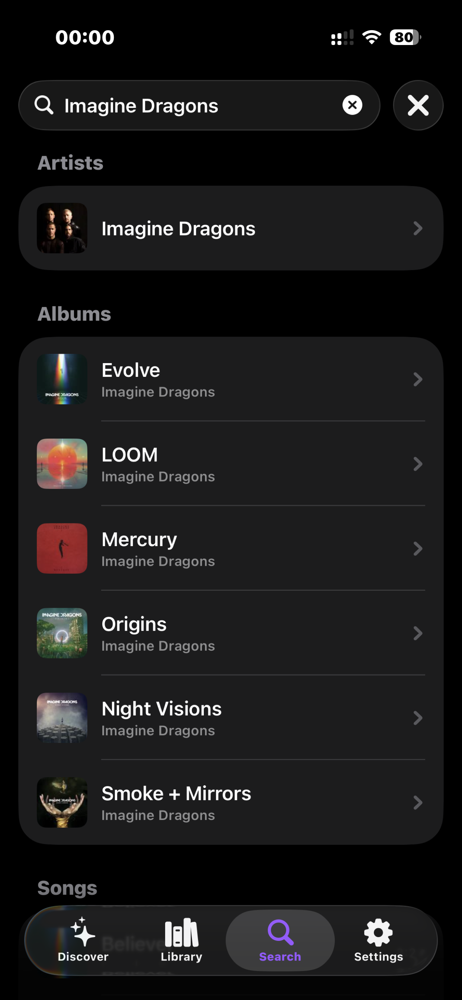

<p align="left">
  
</p>

# Shelv

A native, album and artist focused iOS and iPadOS client for [Navidrome](https://www.navidrome.org/) and Subsonic-compatible music servers, built with SwiftUI. Also available as a [native macOS app](https://github.com/gatzenga/Shelv-Desktop).


## Features

- **Browse your library** — Albums and Artists with alphabetical index bar and grid or list layout
- **Discover** — Recently added, recently played, frequently played, and random albums at a glance
- **Smart mixes** — One-tap shuffled queues based on newest, most played, or recently played tracks
- **Full playback control** — Play, pause, seek, skip with shuffle, repeat, AirPlay support and lock screen integration
- **Smart queue system** — Play Next, Album queue, and a user backlog with drag-to-reorder and swipe-to-delete; shuffle merges all three queues into one mixed list and restores the original order when turned off
- **Search** — Find artists, albums, and tracks on your server with debounced live results
- **Cover art** — Memory and disk cached artwork throughout the UI, never blocks the main thread
- **Multiple servers** — Manage and switch between Subsonic/Navidrome server configurations
- **Library sync** — Full scan with progress indicator and last-sync timestamp per server
- **Theming** — Choose an accent color to personalize the interface
- **Persistent player** — Queue and playback position survive app restarts

## Requirements

- iOS 18 or later / iPadOS 18 or later
- Xcode 16 or later
- A running [Navidrome](https://www.navidrome.org/) or Subsonic-compatible server

## Getting Started

1. Clone the repository:
   ```bash
   git clone https://github.com/gatzenga/Shelv.git
   ```
2. Open `Shelv.xcodeproj` in Xcode.
3. Select a simulator or connected device and hit **Run** (`⌘R`).
4. On first launch, enter your server URL and credentials.

> No external dependencies or Swift Package Manager packages are required — the project is fully self-contained.

## Architecture

```
ShelvApp  (@main)
├── ServerStore              — server list, active server, Keychain integration
├── LibraryStore  (@MainActor) — albums, artists, Discover data (disk + memory cache)
└── AudioPlayerService.shared — AVPlayer, 3-queue system, MPRemoteCommandCenter, AirPlay
```

All API communication goes through `SubsonicAPIService.shared` using MD5 token authentication. Cover art is handled exclusively by `ImageCacheService` (actor-isolated, NSCache + disk, concurrent deduplication) — `AsyncImage` is never used directly.

### Queue System

| Queue | Priority | Description |
|---|---|---|
| `playNextQueue` | Highest | Tracks queued via "Play Next" |
| `queue` | Normal | Current album / playback context |
| `userQueue` | Lowest | User backlog, max 200 songs |

Playback order: `playNextQueue` → `queue[currentIndex+1...]` → `userQueue` (one track at a time, not as a block).

**Shuffle** — When enabled, all three queues are merged into a single shuffled list inside `queue`; `playNextQueue` and `userQueue` are cleared. A snapshot of the pre-shuffle state is saved. When shuffle is disabled, the original order is restored, keeping only the tracks that have not been played yet. Tracks added while shuffle is active (via "Play Next" or "Add to Queue") are inserted at a random position in the shuffled queue and are mirrored into the snapshot so they reappear in the correct section when shuffle is turned off. The queue view shows a single "Shuffled Queue" section while shuffle is active.

**Repeat**
- **Off** — Stops after the last track
- **All** — Wraps back to the start of the queue (reshuffled if shuffle is on)
- **One** — Replays the current track on natural end; a manual skip advances to the next track

**Jump** — Tapping any track in the queue removes it from its position, inserts it directly after the current track, and starts playback immediately. Nothing before it is discarded.

### Caching Strategy

`LibraryStore` applies a stale-while-revalidate pattern: on launch it loads albums and artists from disk immediately, then silently refreshes from the server in the background. A loading spinner is only shown on the very first launch when no disk cache exists yet.

## Supported Audio Formats

Shelv streams audio using `format=raw` (no server-side transcoding) and relies on AVFoundation for decoding: MP3, AAC, M4A, ALAC, WAV, AIFF, FLAC, Opus.

## Authentication

Credentials are authenticated using the Subsonic API's token-based method: `MD5(password + salt)`. Passwords are stored in the system Keychain per server UUID and never sent in plain text.

## Contributing

Pull requests are welcome. For larger changes, please open an issue first to discuss what you'd like to change.

## License

See [LICENSE](LICENSE) for details.

## Screenshots

<p align="center">
  
  
  
  
</p>
<p align="center">
  
  
  
</p>
